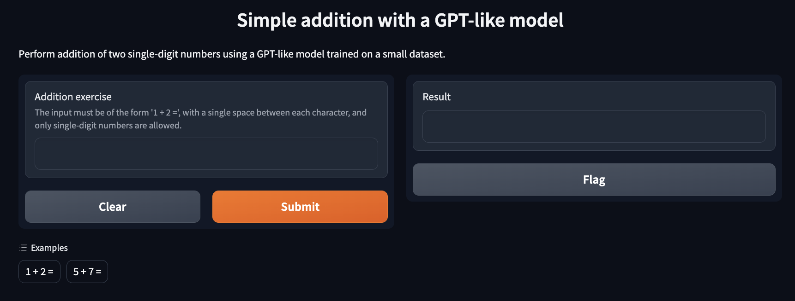

# Simple GPT-like model trained to perform single-digit numbers addition
A simple GPT model trained from scratch. This is an educational model where you can learn how to train LLMs from scratch using the Transformers library.
The model can be found in the [training.ipynb](https://github.com/Manuel-2011/simple_llm/blob/main/training.ipynb) file and can be trained locally on your machine.

## Architecture
The model will have the same architecture as GPT 2 but with a few modifications for making it smaller. The main changes are the size of the vocabulary that it is 13 because it will only handle numbers plus the padding token, the "+", and "=". The context window will only support 6 tokens since we are only interested in performing the addition of two single digits.
This model has 2.7 million weights instead of the 124 million parameters of the "gpt2" default config.
## Usage
You can see the model in action [here!](https://huggingface.co/spaces/Manuel2011/gpt_simple_addition)
The model was trained to complete sequences of text of the form "1 + 3 =".

## Install and train your own model
1. Clone the repository `git clone https://github.com/Manuel-2011/simple_llm.git`.
2. Install the requirements `pip install requirements.txt`.
3. Execute the [training.ipynb](https://github.com/Manuel-2011/simple_llm/blob/main/training.ipynb) notebook.
